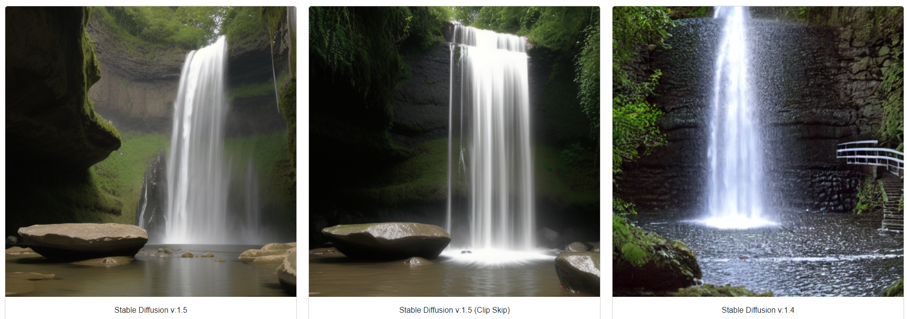
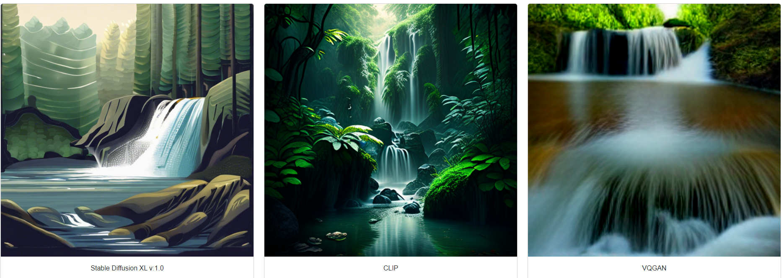
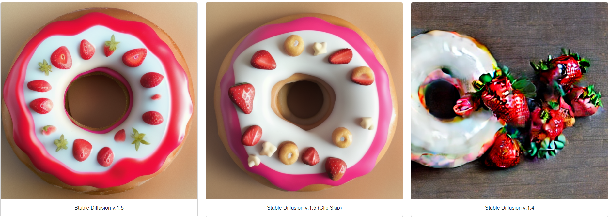
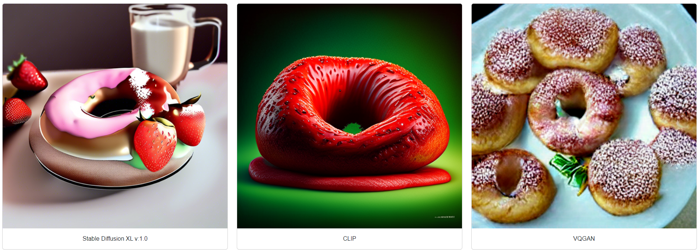
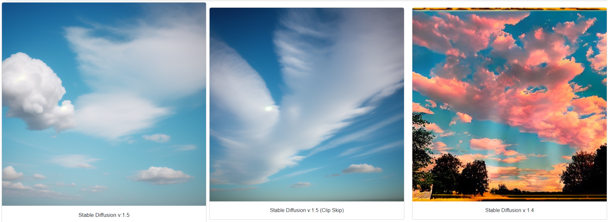
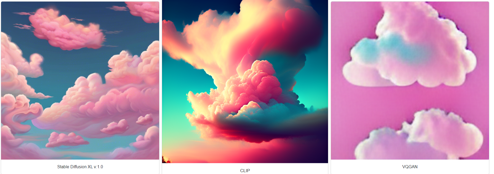

# Bitirme-I

# Webb App For Image Generation From Text

Text girdisinin, farklı metotlar ile görüntüye dönüştürüldüğü web uygulaması.

## İçindekiler

- [Giriş](#giriş)
- [Yöntem](#yöntem)
  - [Stable Diffusion](#stable-diffusion)
  - [Stable Diffusion XL](#stable-diffusion-xl)
  - [VQGAN](#vqgan)
  - [CLIP](#clip)
- [Bulgular](#bulgular)
- [Sonuç](#sonuç)

## Giriş

Günümüzde teknolojinin insanların hayatında, insanların oluşturduğu ve uğraş verdiği alanlarda yeri ve önemi çok büyük bir hale gelmiştir. Bu alanlardan birisi de projemizi gerçekleştirdiğimiz alan olan benzersiz görüntü üretimidir. Projemizde kullanıcıdan alınan text içeriğinden bir görüntünün oluşturulması amaçlanmıştır. Bu çalışmamızı gerçekleştirebilmemiz için kullandığımız bazı teknolojiler aşağıdaki gibidir:

- Python
- PyCharm
- Visual Studio Code
- Flask
- Torch
- Diffusers
- Transformers
- Matplotlib
- Numpy
- PIL

Yukarıda sıralanan IDE ve kütüphanelere ek olarak, projede incelenen görüntü üretim yöntemleri ise aşağıdaki gibidir:

- Stable Diffusion
- SDXL
- VQGAN
- CLIP

Yukarıda sıralanan yöntemler arasında bir kıyaslama yapılması amacıyla yöntemlerin aynı girdiye karşılık ürettikleri çıktılar, bir web uygulaması üzerinde gösterilmektedir.

## Yöntem

Görüntü üretimi için gerekli ilk madde, çalışmanın yapılabilmesi için gerekli olan donanımdır. Projemiz maksimum verimlilik için CPU üzerinden değil GPU üzerinden çalışmaktadır. GPU kullanımının amacı, paralel işleme özelliği ve yüksek performanslı hesaplama yapabilme özelliği olarak sıralanabilir. Elimizde bulunan en iyi ekran kartı NVIDIA GeForce RTX 2060 kullanılmıştır.

### Stable Diffusion

Stable Diffusion, metin ve benzersiz görüntü üretimi amacıyla oluşturulmuş bir üretici yapay zeka modelidir. Prensipte, difüzyon modelleri bir görüntüyü kodlamak için Gauss gürültüsünü kullanır. Ardından görüntüyü yeniden oluşturmak için bir ters difüzyon işlemi ile birlikte bir gürültü öngörücü kullanırlar. Çeşitlilik maksadıyla bu yöntemi kullanan birden fazla eğitilmiş model kullanılmıştır. Bu yöntem için kullandığımız modeller “stable-diffusion-v1-4” ve “stable-diffusion-v1-5” modelleridir.

### Stable Diffusion XL

Stable Diffusion XL, daha iyi çıktı üretmesi amacıyla yeniden dizayn edilmesi ve güncellenmesiyle oluşturulmuş yeni bir model olarak tanıtılmaktadır.  Encoder ve decoder ağlarından oluşur. Diffusion işlemi, görüntüdeki piksellerin gradyanlarının düzenlenmesiyle gerçekleştirilir. Bu yöntem için kullandığımız model “sdxl-1024-v1-0” modelidir.

### VQGAN

GAN Mimarisi üzerine kurulu ve vektör kuantizasyonu kullanan bir modeldir. Giriş verisi düşük boyutlu bir vektöre özetlenir. Encoder, Quantizer ve Decoder ağlarından oluşur. Min-dalle kütüphanesi aracılığı ile projemizde decoder ağını vqgan bazlı kullanan bir yöntem daha uyguladık. Böylece bir GAN türünü de kıyaslama fırsatı yakalamış olduk.

### CLIP

CLIP yöntemi, kontrastif öğrenme yöntemini kullanan bir modeldir. Dil ve görüntünün aynı uzayda temsil edildiği bir modeldir.  Metin ve görüntü temsilcileri kullanarak prompt’a karşılık gelen benzer temsilleri üretirler. Projemizde eğitilmiş bir CLIP modeli olan ‘kandinsky-2-1’ modeli kullanılmıştır. 

## Bulgular

Aşağıda, web uygulamamızda kullanılan görüntü üretme yöntemlerinin örnek olarak girdiğimiz prompt girdilerine karşılık verdikleri çıktı görüntüler bulunmaktadır.

**Prompt: Waterfall | Adım Sayısı: 100**

**Prompt: Donut with Strawberry | Adım Sayısı: 10**

**Prompt: Cotton candy clouds | Adım Sayısı: 7**

## Sonuç

Sonuç olarak, kullanılan yöntemlerin ürettikleri çıktı görüntülerinin, hangisinin veya hangilerinin daha iyi olduğu kullanıcının kişisel tercihine bağlı kalmıştır. Bunun yanında projenin geliştirilme aşamasında iş bölümü, iletişim, zaman yönetimi gibi konuların ve bu konuların önemlerinin öğrenildiğini söyleyebiliriz. Karşılaştığımız zorluklar ise donanım kaynaklı sorunlardan ve bazı çalışmalarda kullanılan eğitim veri kümesine erişimin kısıtlanmış olmasından kaynaklı olması gibi sorunlardan oluşmaktadır ve yeterli kaynaklar sağlandığı takdirde daha fazla yöntem projeye eklenebilecektir.

